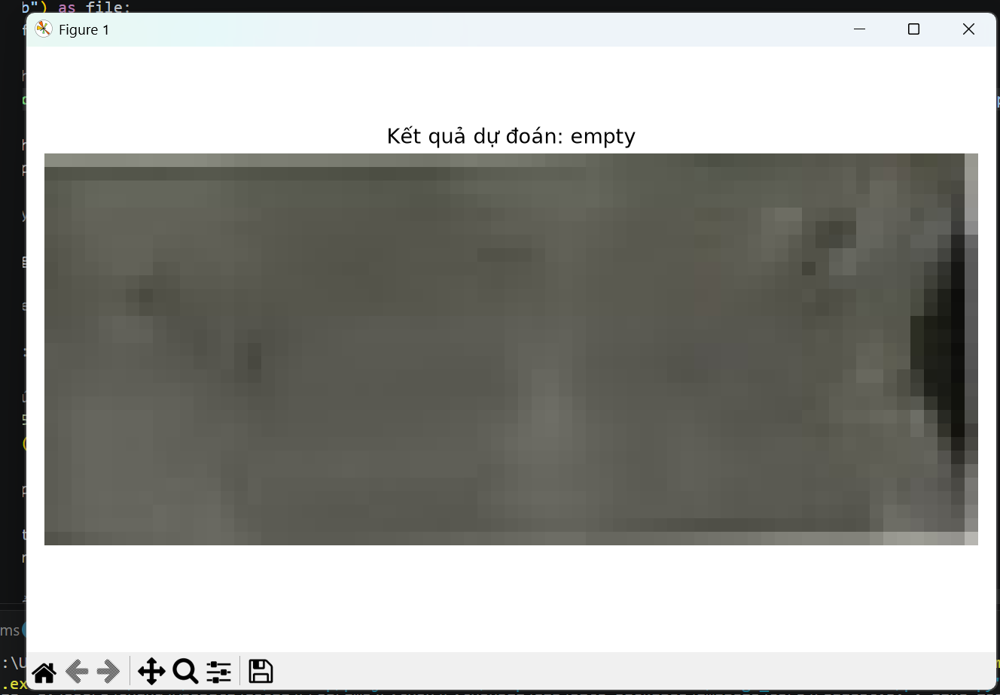
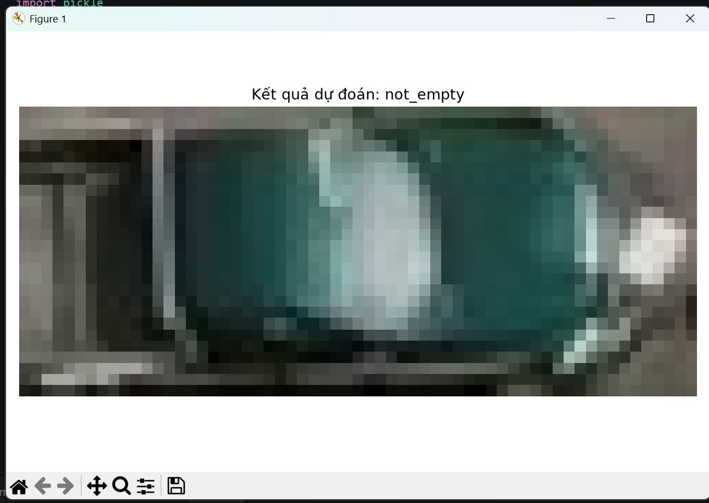

# Parking Space Image Classification




Dự án Computer Vision phân loại một vị trí đỗ xe thành:

- `empty`: vị trí còn trống
- `not_empty`: vị trí có phương tiện

## Phương pháp

1. Đọc ảnh bằng `scikit-image`.
2. Resize ảnh về `15 × 15`.
3. Flatten ảnh thành vector một chiều.
4. Huấn luyện mô hình SVM.
5. Tìm tham số bằng GridSearchCV.
6. Dự đoán và hiển thị kết quả bằng Matplotlib.

## Cấu trúc project

```text
Image_classification/
├── assets/
│   ├── prediction-empty.png
│   └── prediction-not-empty.png
├── Image_classification.py
├── predict.py
├── model.pkl
├── requirements.txt
├── .gitignore
└── README.md
